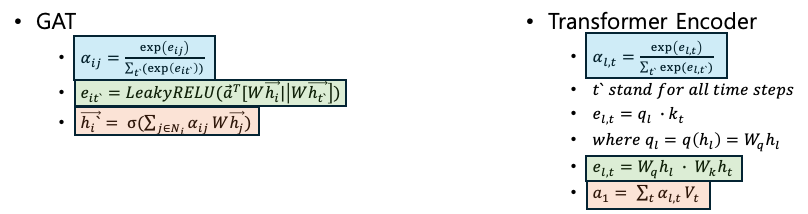

# GAT VS Transformer Encoder

---

- 공통점
    - Attention Mechanism 
    - Self attention 수행
- 차이점 및 문제점
    - GAT 의 경우 query, key 를 구분하지 않고, 하나의 W로 연산 수행하며, self-attention 의 경우 query, key 에 대한 각각의 weight 존재
    - GAT connection 정보를 알 필요가 있음
    - Global feature, AU features 간 연관성 학습에 있어, heterogeneous graph 이며, 이는 연관성 학습에 적합하지 않음

    - GAT 특징: 연결된 노드들 간의 어텐션 사용 -> 그래프 구조에 대한 어텐션 메커니즘이 적용 가능해진다 (Graph topology를 활용할 수 있다는 장점)
    - 그러나, FC graph라면 self attention 과 차이가 없으므로, graph topology 에 대한 장점 상쇄 됨

.
.
.
수식 정리중
$$ 
\mathbf{a}_{i j}=\mathrm{softmax}\left(\mathbf{a}_{i j}\right)=\frac{\exp \left(\mathbf{a}_{i j}\right)}{\sum_{k} \exp \left(\mathbf{a}_{i k}\right)}
$$
$$
\mathbf{e}_{i j}=\mathrm{LeakyReLU}\left(\mathbf{W}_{e} \cdot\left[\mathbf{h}_{i}, \mathbf{h}_{j}\right]\right)
$$
$$
\mathbf{a}_{i j}=\mathrm{softmax}\left(\mathbf{a}_{i j}\right)=\frac{\exp \left(\mathbf{a}_{i j}\right)}{\sum_{k} \exp \left(\mathbf{a}_{i k}\right)}
$$
$$
\mathbf{h}_{i}^{\prime}=\mathbf{h}_{i} \cdot \mathbf{a}_{i j}
$$
$$
\mathbf{h}_{i}^{\prime}=\mathbf{h}_{i} \cdot \mathbf{a}_{i j}
$$
$$
\mathbf{h}_{i}^{\prime}=\mathbf{h}_{i} \cdot \mathbf{a}_{i j}
$$

