# Is attention all we need?

#### 2023년 광운대학교 인공지능I 수업에서 진행한 발표의 스크립트 내용을 복붙한거라. 구어체에욤
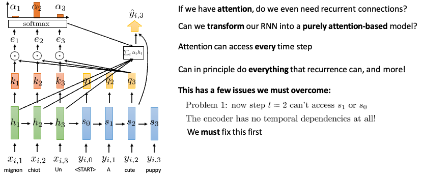

어텐션을 갖고 있으면, recurrent 연결이 필요할까요?

RNN 을 순수하게 어텐션 기반의 모델로 변경이 가능할까요?

어텐션은 모든 타임스텝에 접근이 가능하고

리커런스에서 할 수 있는걸 다 할 수 있습니다.

이를 통해서, 어텐션은 리커런스가 할 수 있는걸 다 할 수 있는데, 모델을 만들기전에 몇가지 문제가 있는데 

디코더 스테이트인  l=2 스텝에서 디코더의 s1 이나 s0에 접근하지 못하는 문제를 해결해야함

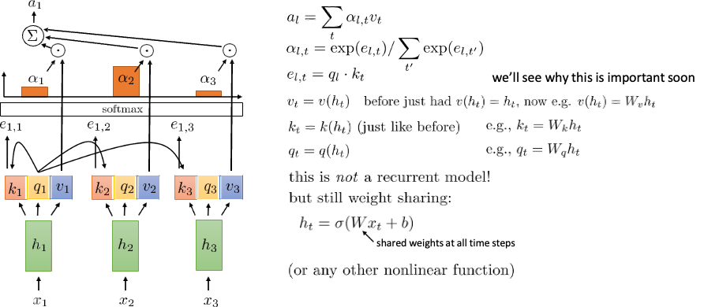

이 과정은 셀프 어텐션에 대한 설명인데요

아래 셀프 어텐션을 위한 타임스텝 1의 다른 타임스텝의 키값과의 상호작용 과정부터 확인하겠습니다.

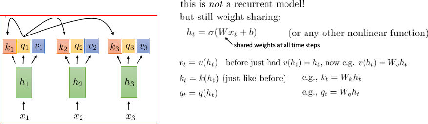

키, 쿼리, 값을 생성하는 입력 레이어의 기본인데요, 모든 시간 단계의 키와 시간 1에서의 쿼리의 인터랙션에 대한 설명입니다.

Timestep 1 의 쿼리 값과 다른 타임스텝의 키값과의 상호작용 과정입니다.

우선 입력인 x_t 를 쉐어드 웨이트인 W와 연산하고 이 계산을 통해 h_t 값을 구해줍니다.
h_t 값을 기반으로 x_t에 대한 키, 쿼리, 밸류에 대한 계산을 우측 식과 같이 계산합니다.
이 과정에서 각각의 웨이트인 W_q, w_k, W_v 가 사용됩니다.

이처럼 리커런트 모델이 아님에도, 웨이트 쉐어링이 이루어지고 있음을 확인 할 수 있었고

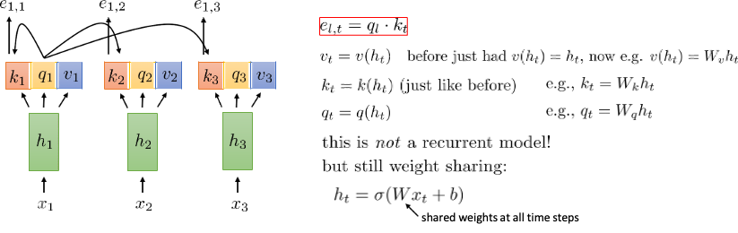

이전의 과정을 통해
어텐션 스코어를 앞서 구한 q_l 과 k_t 를 닷프로덕트 연산으로 구하게 됩니다.
이 식에서는 e_l,t 로 표현하여, q_l 을 사용했는데,
여기서 l 은 몇번째 타임스텝에대한 어텐션 스코어인지 나타내고,
T는 자신을 포함한 다른 모든 time-step 을 의미합니다.

키, 쿼리, 값을 생성하는 입력 레이어의 기본 사항과 모든 시간 단계의 키와 시간 1에서의 쿼리의 상호 작용입니다.

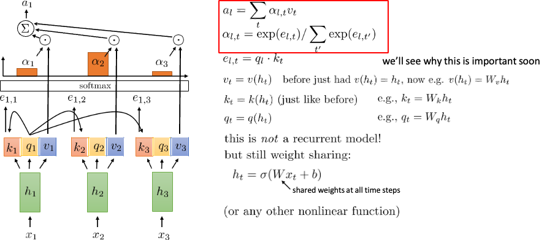

이게 이제 마지막 셀프어텐션의 마지막 과정인데요,
앞서 구한 attention –score 를 소프트맥스를 거쳐 알파 값을 구한 다음 
Step l 에 대해서 t에 대해 노멀라이즈 하고싶은데 그래서, 우리는 각 타임스텝에 대한 소프트맥스 벡터를 갖고 싶고 이게 모든 쿼리와 대응되면서, 모든 쿼리인 q_l 을 통해 알파 l,1 l,2 l,3 를 얻게 된다.
여기 있는 소프트맥스는 t에 대해 합연산을 하지, l에 대해서는 합연산을 진행하지 않는다.

이 과정 이후, 알파랑 밸류를 구했으니, 이 식의 연산 과정을 거쳐
A_1 이라는 time-step 1 에 대한 어텐션이라 불리는 context vector을 구할 수 있습니다.
이 context vector 는 float으로 이루어진 하나의 벡터입니다.

이 과정을 l=1 에 대해 수행 한 결과이고, 이걸 l = 2, 3. 에 대입 할 수 있습니다.
방금까지 말씀드린 모든 과정이 셀프 어텐션 메커니즘이고, 이 셀프 어텐션 메커니즘을 통해 모든 타임스텝에 대한 어텐션을 얻어 낼 수 있으며, 
이 셀프 어텐션 전체 과정을 전체 타임스텝에 대한 정보를 합치는 하나의 레이어로 생각해도 됩니다.

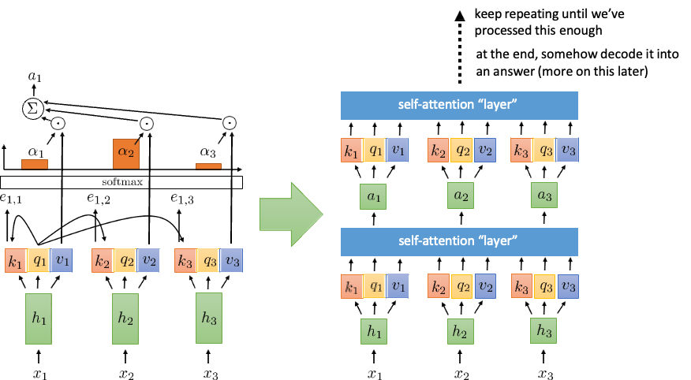

앞서 말씀드린것 처럼 셀프어텐션을 하나의 레이어로 취급할 수 있어 우측 처럼 표현 할 수 있고,

아래 단게의 어텐션 레이어의 출력으로 activation을 내보내고 다음 레이어의 입력으로 활용할 수 있으며

이 일련의 과정을 충분히 반복하면, 각 스텝에서, 시퀀스에 대해서 더 많이 프로세싱 하게 되고

최종적으로, 디코딩 과정에서 이 어텐션이라는 컨텍스트 벡터를 정답으로 만들 수 있습니다.

여기까지가 셀프 어텐션의 기본적인 아이디어입니다.

셀프 어텐션이 어떻게 동작하는지 알았고, 이걸 통해서 이루고자 하는게 뭔지도 이전페이지에서 말씀 드렸습니다.

셀프 어텐션의 기본 개념은 트랜스포머라고 불리는 매우 강력한 유형의 시퀀스 모델을 개발하는 데 사용될 수 있습니다

그러나 이를 실제로 작동시키려면 몇 가지 기본적인 한계를 해결하기 위해 몇 가지 추가 구성요소를 개발해야 합니다

첫째, 순서에 대한 정보가 부족하기 때문에, 포지셔널 인코딩을 개발해야 하고
둘째, 각 레이어에서 여러 위치에 대해 쿼리하기 위해 멀티 헤드 어텐션이 필요하며
셋째, 각각의 연속적인 레이어는 이전 층에 대해 선형이기에, nonlinearities 를 추가해야합니다.
이게, 식으로 보시면, a_l 이 모든 위치에 대한 합인데, v_t 는 h_t 에 대해 리니어 하기 때문에, v_t 는리니어 하게 됩니다. 
알파 값은 리니어 하지 않지만 밸류가 리니어 하기 때문에, 이 알파 값을 적절히 사용하기에, 덜 적합 할 수 있어서, 여기에 넌리니어리티를 추가 해 줘야 합니다.
마지막으로, 이후 값에 대한 어텐션 룩업을 방지하기 위해 마스크드 디코딩 과정이 필요합니다. 
여기서 말하는 어텐션 룩업은, 하나의 어텐션 스코어나, 어텐션 값을 구하기 위해, 특정 타임스텝 l 의 이전 타임스텝과 이후 타임스텝 모두와 연산을 하기 때문에, 디코딩 과정에서도, 이후에 어떤 값이 나올지 미리 알고 그에 대한 예측 혹은 생성을 할 수 있다. 라는 문제 입니다.

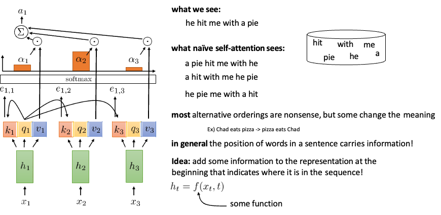

우리가 저 he hit me with a pie 문장을 보면, 저렇게 보이는데,
Naïve한 셀프 어텐션은 그냥 우측의 bag of word 로 봐요, 이는 아래의 예시처럼 순서를 꼬아서 볼 수 있게 됩니다.
이럴 경우에, 순서만 바뀐게 말도 안될 수 있는데, 의미가 바뀔 수 있습니다.
예시를 보시면, 순서가 바뀌었는데, 의미가 바뀌어버린 모습을 보실 수 있고, 위에 있는 pie 와 hit 에 대한 내용을 보시면, 넌센스 함을 아실 수 있습니다.
그래서, 문장에서 단어의 순서를 알게하는것이 중요합니다.

문장에서 단어의 위치는 정보를 전달하는데, 이러한 단어의 위치 정보가 없기 때문에, 문제가 발생하게 됩니다.
순서에 있는 위치를 나타내는 몇 가지 정보를 맨 앞의 표현에 추가하여, 이런 문제를 해결 한다. 라는 아이디어가 포지셔널 인코딩 입니다.

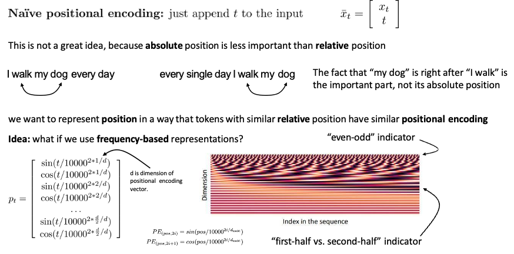

나이브 한 포지셔널 인코딩은 입력에 seq 정보를 갖는 time_step 인 t 를 append 하는 방식으로 이루어지는데,

이는, 절대적인 위치보단 상대적인 위치가 더 중요한 정보를 담고있기 때문에 좋은 아이디어가 아닙니다.

아래의 예시를 보시면, ‘My Dog'가 ‘I walk' 바로 뒤에 있다는 것이 중요하지,  그 절대적 위치가  중요한 부분이 아닙니다.

그렇다면, 상대적으로 유사한 위치에 표현되어있는 토큰이 유사한 위치에 대한 인코딩을 갖는 방식으로 포지셔널 인코딩을 진행하고 싶다, 라는 문제가 있었고

이를 해결하는 방법으로, 주기를 기반으로 하는 표현 방식을 사용하는것을 제안했습니다.

포지셔널 인코딩은 vector p_t 로 표현되며, input인 x_t 와 동일한 길이를 갖습니다.

여기 나오는 10000^2*i/d  frequency term으로 사용했고, 여기서 d 는 포지셔널 인코딩 벡터의 디멘젼을 의미하구요.
이는 실제 위치 t 에 대해서, 각 디멘젼에 따라 스켈링 과정을 거치고 이를 통해 , t를 나누는 값이 크게는 10000 의 1승 부터 작게는 10000의 2/d 승 까지 가게 됩니다. 각 위치 't'에 대해 고유한 sinusoidal 인코딩이 됩니다. 
d 는 논문에서는512 입니다

우측 하단의 히트맵은 이러한 포지셔널 매트릭스에 대한 시각화 결과이며, 
색 차이는 sin / cos 이 번갈아 등장하기 때문에 나타난것이고,
그래프 x 축은 seq 의 인덱스를 나타내고 
Y축은 디멘젼을 나타냅니다.

첫 몇개의 row는 이븐/오드 인디케이터 로 작용하고 이거는 사인 코사인 을 알아내기 위해 사용됩니다
이 row 들로, 이후에 어떤 포지션에 relative한 정보가 포함되는지 사용이 될 수 있다. 라고 합니다.
출처 : [https://youtu.be/4AzsiCMw_-s?list=PL_iWQOsE6TfVmKkQHucjPAoRtIJYt8a5A&t=433]
이는 논문에서 제시한 PE 함수에서 홀수일때, cos 선택하고, 짝수일때 sin 을 선택하기 때문에, 이런 효과를 가져올 수 있다고 해석했습니다.

Fist half vs second half indicator는
‘i’  가 작을 때: $pos/10000^{2i/d_{model}} $​ 값의 변동이 작습니다. 즉, pospos 값이 변해도 sine과 cosine의 입력 값이 크게 변하지 않습니다. 이로 인해 주기가 길어지게 됩니다.
'i'가 클 때: $pos/10000^{2i/d_{model}} $​ 값의 변동이 큽니다. 따라서 pospos 값이 조금만 변해도 sine과 cosine의 입력 값이 크게 바뀝니다. 이로 인해 주기가 짧아지게 됩니다.

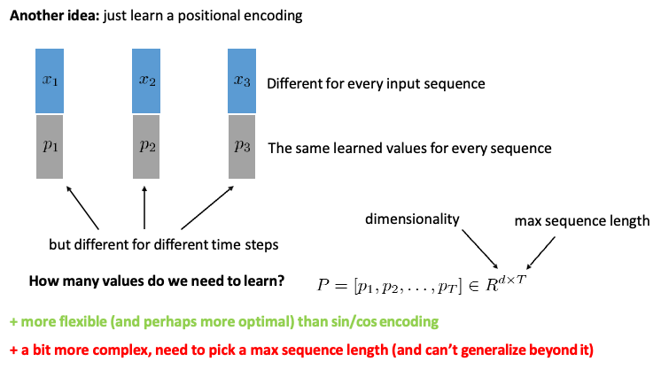

다른 방법으로는 포지셔널 인코딩을 학습을 시키는 방법도 있다고 나와있습니다.

앞에 등장한, 그래프를 다시 보시면, 매트릭스이고, 이 매트릭스는 dimension 이랑 seq 로 이루어져있는데,

우리는 이 전체 매트릭스를 러너블 파라미터로 학습을 시킬 수도 있겠죠?

이 학습된 포지셔널 인코딩 방식이라는건
서로 다른 인풋 시퀀스에 대해, p 가 있는데, 모든 시퀀스에 같지만, 각 타임스텝에는 다른, 그런 p가 됩니다.

학습을 시키기 위해선 가장 긴 정보의 길이와, 포지셔널 인코딩 차원으로 지정한 d 에 포함되는 p 가 필요하게 됩니다.
이때, 장점으로는 앞서 말씀드린 사인 코사인 함수를 활용한 방식보다, 더 유연하며 옵티멀 할 수 있으나,

문장이 짧을때는, 제로패딩을 통해 해결 할 수 있지만, 문장이 학습을 위해 사용된 맥스 시퀀스 길이보다 길 경우에는 문제가 발생하게 됩니다.

포지셔널 인코딩 방식을 셀프 어텐션과 어떻게 합칠지 입니다.

각각의 스텝에서, 우리는 x_t 와 p_t 를 갖고 있는데, 

가장 쉬운 방법으로는 그냥 컨캐트네이션 하는 방식이고

다른 방식은 셀프 어텐션의 입력으로 어떤 학습된 함수에x_t를 넣고 pt 를 더해서, 넣어주는 방식입니다.

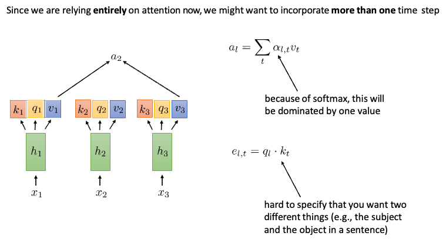

멀티 헤드 어텐션 입니다. 

어텐션을 통해서, 하나의 타임스텝 뿐 아닌, 다른 여러 타임스텝에 대해서도 단계를 통합하고 싶은데,

이를 위한 방법으로 멀티 헤드 어텐션이 나왔습니다.

어텐션의 식은 다음과 같고 이 식에서 알파 값은 소프트맥스 때문에, 하나의 값을 갖게 됩니다. 여러개가 아니죠

그리고, 아래의 어텐션 스코어 계산식은 어텐션을 구할 쿼리와 다른 모든 키에 대한 어텐션 스코어를 계산하는 과정인데, 

이 과정에서 서로 다른 두개(예를 들면 문장 내의 주어와 목적어)를 특정하기 어렵다고 합니다.

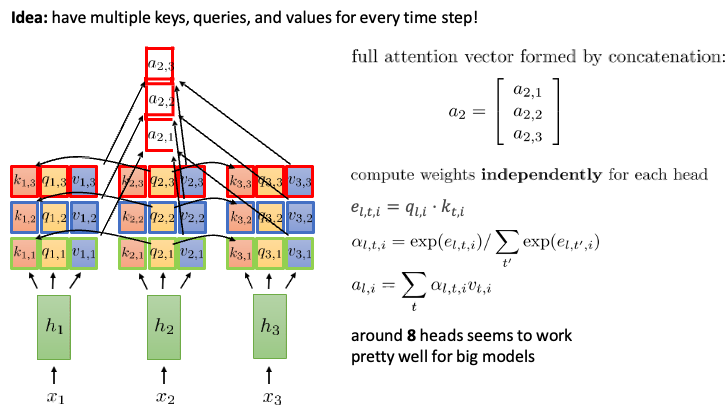

그래서, 이러한 문제점들이 있어서,  모든 타임스텝에 대한 여러개의 키, 쿼리, 밸류 쌍을 가지면 어떠할까? 라는 아이디어에서 출발하게 되는데요

각각의 셀프 어텐션 레이어는 하나의 키, 밸류, 쿼리를 각 타임스텝 마다 갖고 있는데,  이러한 값을 만들어내는 필터(헤드)를 레이어에 더 추가하면, 더 많은 키, 밸류, 쿼리 쌍을 얻을 수 있습니다.

이를 통해 full attention vector 는 각각의 헤드를 통해 나온 어텐션 값의 컨케터네이션으로 계산이 되고

각각의 헤드에서 웨이트 값을 독립적으로 계산하게 됩니다.

그래서, 이전에 봤던 셀프 어텐션 식은 다음과 같이, 변하게 됩니다.

여기서 I 는 헤드의 번호이구요
T 는 모든 타임 스텝
L은 어텐션값을 구할 타임스텝을 의미합니다.

우선 이전과 동일하게 어텐션 스코어를 계산하고
계산된 어텐션 스코어를 소프트맥스를 통과시켜주면 알파 값이 나옵니다.

이제 이 알파값을, 각 헤드의 밸류 벡터와 함께, 시그마를 취해주면,

헤드에 대한 어텐션이 구해지게 됩니다.

이 모든 과정은 각 헤드인 i에 대해 independently 계산을 하게 됩니다.

논문에서는 8개의 헤드를 사용했다고 합니다.
전체 어텐션의 디멘젼은 512인데, 헤드를 8개로 나눴다고 하니까 각 헤드는 64의 크기를 갖게 된다고 합니다.

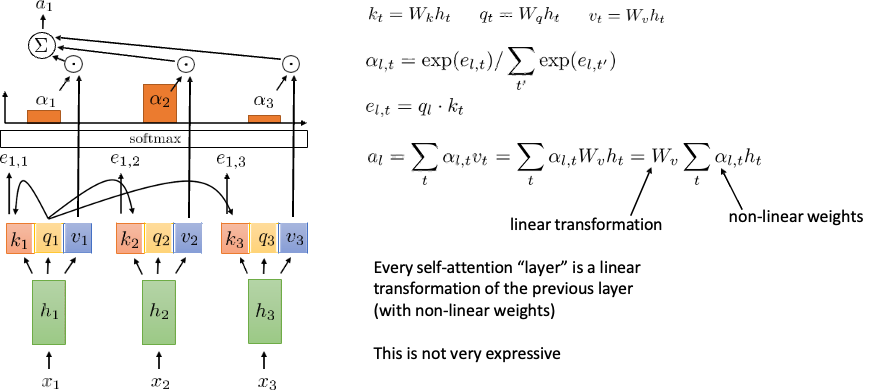

다음 문제는 셀프 어텐션이 선형 함수이다. 라는 문제 인데요.

리니어 트랜스포메이션이 들어가기 전 식은 모두 어텐션에 대한 설명때 보여드렸던 식이구요

여기서 알파를 구하기 위해서 넌리니어한 과정이 있지만

이후에 어텐션을 구하기 위해 리니어 컴비네이션이 사용되기 때문에, 

이 걸 식으로 보면, 여기서 l 번째 어텐션을 구하기 위해 사용된 식에서 마지막 연산 과정에서, 밸류에 대한 웨이트가 앞으로 빠져나오고 이 식이 리니어 하게 변형이 되게 됩니다.

그래서, 모든 셀프 어텐션 레이어는 이전 레이어의 비선형 웨이트에 대한 리니어 트랜스포메이션이고 

이게 값을 잘 표현 할 수 없는 문제가 생기는 겁니다.

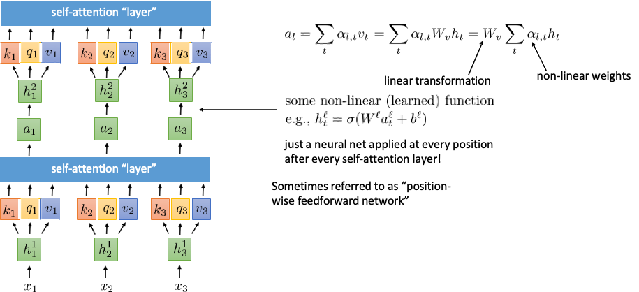

그래서, 이 리니어리티를 제거하기 위해 

Non-linearity 를 프로세스 내부에 조금 추가해주면 되는데,

이를 위해서, 학습된 비선형 함수와 함께 셀프 어텐션 레이어를 교대로 지나갑니다.

이걸 그림으로 보면 이 화살표가 가리키는 저곳에 학습을 통해 만들어진 비선형 함수를 적용시키는게 되는거구요

이 비선형 function 은 매 셀프 어텐션 레이어마다 모든 t에 대해 적용되어서, 

이를 포지션 와이즈 피드 포워드 네트워크 혹은 비선형 네트워크 라고도 부르기도 합니다.

보통, dense 나 linear 레이어를 사용한다고 합니다.

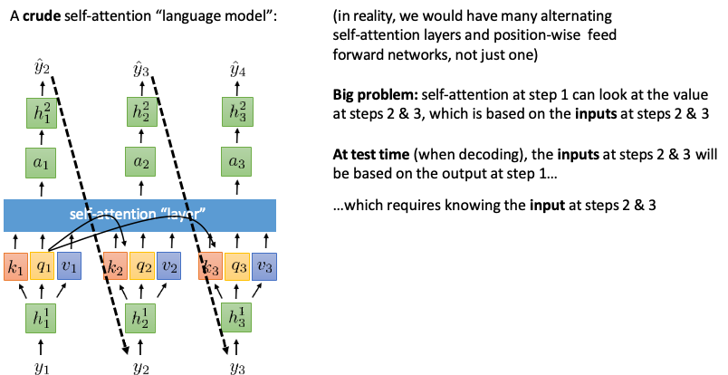

이 셀프 어텐션같은 경우 실제로는, 많은 셀프 어텐션이랑, 포지션 와이즈 피드포워드 네트워크를 많이 가질것이지만, 하나의 레이어에 대해서만 생각을 해보겠습니다.

디코딩 과정에서 문장 생성을 목표로 한다고 예를 들면, 
첫 타임스텝의 아웃풋을 두번째 타임스텝의 입력으로 해야, 첫번째 타임스텝에 대한 정보를 포함하게 됩니다.
이와 마찬가지로 두번째 타임스텝의 아웃풋을 세번째 타임스텝의 인풋으로 넣어야 합니다.

여기서 문제가 발생을 하는데, 앞서 셀프 어텐션에서 보신바와 같이 어텐션을 구할 쿼리가 모든 타임스텝의 키와 interaction 을 하기 때문에, 타임스텝 1 에서 타임스텝 2 와 3 에서 들어올 입력값인 타임스텝 2 와 3의 값을 볼 수 있다는 거죠.

이렇게 되면, 두번째에 들어가는 값에, 첫번째에서 어텐션을 계산할떄, 두번째와 세번째 타임스텝에 있는 정보가 들어갔고, 세번째에도 마찬가지로 동작하게 되는데 이 경우

디코딩 과정에서 스텝 1의 아웃풋은 스텝 2,3의 영향을 받고 스텝 2의 아웃풋은 스텝 1의 아웃풋의 영향을 받는데 이 스텝1의 아웃풋은 스텝 2와 3의 영향을 받았기 때문에, 결국 빙빙 돌게되는 circular dependency 가 발생하고, 이는 하나의 토큰에 대한 디코딩에 쓸 수 없어지고, 이는 문장 생성을 할 수 없다 는 문제점을 만들어내죠.

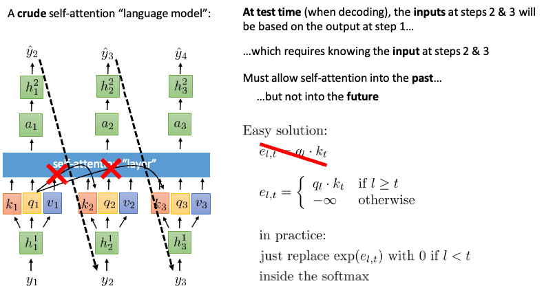

앞서 말씀드린 문제를 해결하기 위해서는, 

과거로의 셀프 어텐션은 열어두고

미래로의 셀프 어텐션에 대해서는 허용을 하지 않으면 됩니다!

이를 수학적으로 표현하면, 어텐션값을 구하고자 하는 쿼리의 순서가 키의 타임스텝 보다 크거나 같을 경우에만, 어텐션 스코어를 계산하고, 그게 아니면 모두 음의 무한대로 지정하면

이를 소프트맥스에 넣었을 때, 결국 미래의 값 즉 t가 l 보다 큰 경우 모두 0이 되어버리는 겁니다.

이제 셀프 어텐션 모델로 미래에 대한 생성이나 디코딩을 할 수 있어졌어요.

앞서 말씀드린 수식의 경우, 코드에서는 음의 무한대 연산을 피하기 위해 위와 같은 방식을 활용합니다.

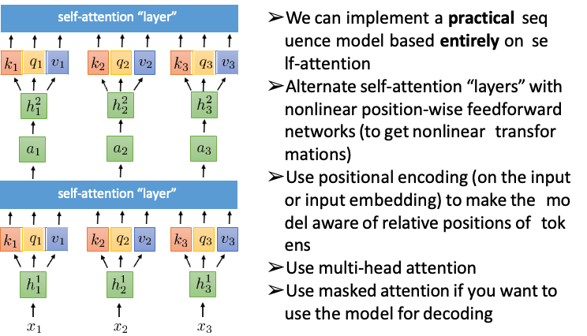

우리는 전적으로 셀프 어텐션에 기반을 둔 시퀀스 모델을 구현할 수 있습니다
비선형 변환을 얻기 위해 포지션 와이즈 넌리니어 피드포워드 네트워크와 셀프 어텐션 레이어를 번갈아 사용하게 됩니다.
포지셔널 인코딩을 사용하여 모델이 토큰의 상대적 위치를 인식하도록 합니다
멀티 헤드 어텐션을 사용을 했고 이를 통해, 하나의 레이어에서 여러개의 키, 쿼리, 밸류 값을 계산 이를 통해, 다른 여러 타임 스텝에 대한 통합이나, 더 많은 토큰간의 관계를 다룰 수 있어, 입력 시퀀스가 갖고있는 정보를 싱글 헤드 어텐션 보다 더 많은 정보로 표현 할 수 있어집니다.
어텐션 모델을 생성이나 디코딩을 위해서 사용하려면 마스크드 어텐션을 사용합니다.

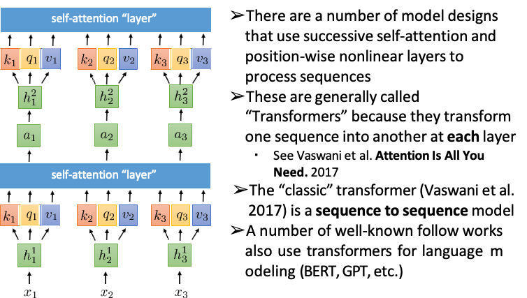

연속적인 셀프 어텐션 및 포지션 와이즈 넌 리니어 레이어를 사용하여 시퀀스를 처리하는 여러 가지 모델 설계가 있는데,
이것들은 각 층에서 하나의 배열을 다른 배열로 변환하기 때문에 일반적으로 "트랜스포머"라고 불립니다
기본적인 트랜스포머는 2017년에 발표된 attention is all you need 논문에 있는거구요 이건 시퀀스 투 시퀀스 모델입니다.
이후 연구로 랭기지 모델중 트랜스포머를 사용한 것들중 대표적인게, 버트나 지피티가 있습니다.

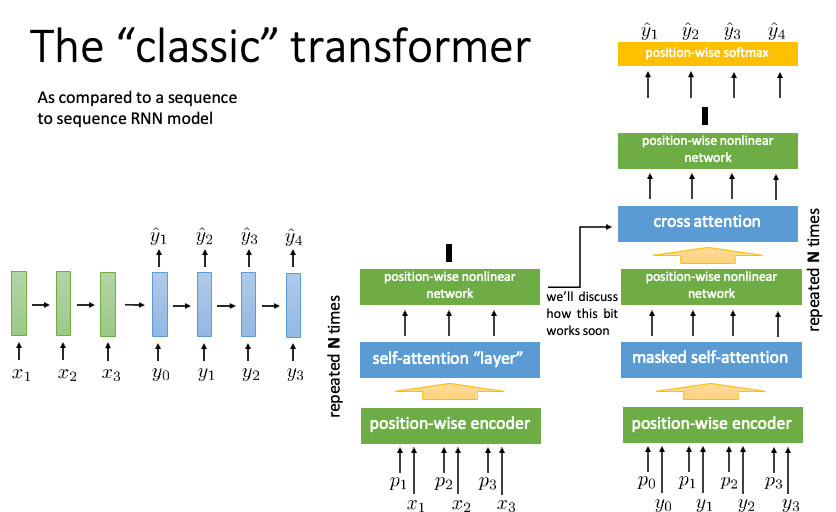

기본적인 트랜스포머 구조입니다.

Seq2seq 모델에서는, 
인코더가 입력 시퀀스를 만들고, 
한번에 하나의 엘리멘트에 대해 다루고, 
히든 스테이트 로 고정된 길이의 표현만 가능했는데, 
이 히든스테이트는 입력 순서로부터 정보를 파악하고, 
디코더가 이 히든스테이트를 받아서, 아웃풋 시퀀스를 엘리먼트 별로 이전 출력에 따라 뽑아내는 것입니다.

트랜스포머 구조는 크게 두개로 나누어 좌측이 인코더 파트 우측이 디코더 파트이며,
좌측의 인코더 파트의 아웃풋을 디코더의 크로스 어텐션으로 보내서 최종적으로 출력인 y햇 원투쓰리를 만들어내는 구조입니다.
이 보내는 과정과, 크로스 어텐션에서 무슨일이 일어나는지는, 이후에 말씀드리겠습니다.

이 그림에서 보시다시피, 트랜스포머는 포지션 와이즈 인코더 이후, 셀프 어텐션과 넌리니어 네트워크 를 N번 쌓는 구조를 따르고, 마찬가지로, 디코더 또한 마스크드 셀프 어텐션 부터 포지션 와이즈 넌리니어 네트워크 까지를 N번 쌓는 구조를 갖고있습니다.

클래식 하게는 6번을 쌓고, 셀프 어텐션 레이어에는 8개의 헤드가 들어간다고 합니다.

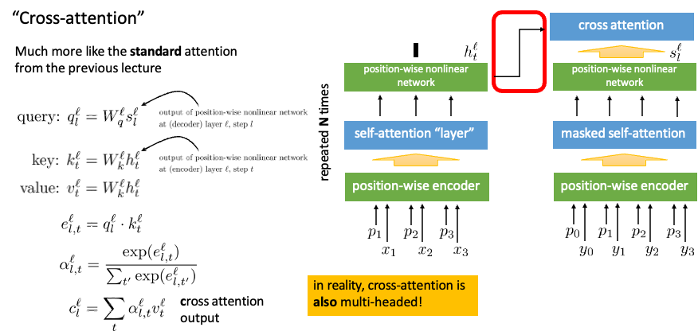

크로스 어텐션 레이어의 입력으로 들어가는 쿼리는 디코더의 넌리니어 네트워크의 출력이고

키와 밸류는 인코더의 넌리니어 네트워크의 출력 값이 됩니다. 이때, 레이어와 타임스텝은 동일합니다. 

이전까지 l 은 어텐션 할 타임스텝에 대한 l 이었다면, 이 페이지에서 l 은 레이어를 의미합니다. 혼동 없으시기 바라며,

크로스 어텐션의 어텐션 스코어를 계산하는 식은 디코더의 쿼리와 인코더의 키 값을 통해 계산하고

이를 소프트맥스 함수를 거쳐 알파 값을 계산 한 뒤, 크로스 어텐션 아웃풋을 구할 수 있습니다.

실제로는 이 크로스 어텐션 레이어 또한 멀티 헤드 어텐션의 구조를 따른다고 합니다.

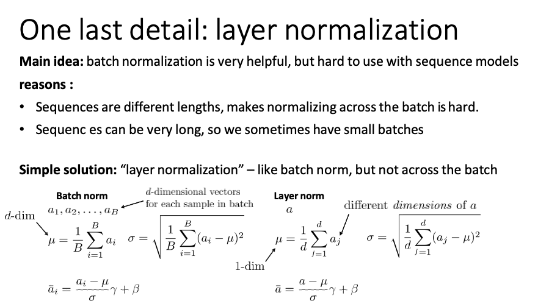

배치 정규화는 매우 유용하지만 시퀀스 모델과 함께 사용하기는 어렵습니다. 시퀀스의 길이가 다르므로 배치 전체를 정규화하는 것이 어렵습니다.시퀀스가 매우 길 수 있기 때문에 작은 배치가 있는 경우가 있습니다
배치 노멀라이제이션 레이어와 같지만 배치에 걸쳐 있지는 않습니다. 
배치의 다른 샘플이 아니라 레이어의 다른 액티베이션에 걸쳐 있습니다.

Standard batch-norm 
에 대해 간단히 말하고 넘어가자면, 

모든 계층의 표준 배치 표준에서는 모든 입력에서 하나의 활성화 벡터가 있습니다.

그리고 일부 층의 각 층에 대해 다른 활성화 벡터를 계산하므로 이들 각각은 a_1, a_2,...a_B는 d -dim 벡터이며, 여기서 d는 해당 층의 차원수입니다

배치 표준은 해당 배치의 모든 점(입력)에 대해 평균과 표준 편차를 계산할 수 있습니다
그래서 mu와 sigma는 d차원 벡터이고 이것들은 모두 엘리먼트 별 연산입니다 
그리고 만약 당신의 액티베이션이 d차원이면, 뮤와 시그마도 d차원입니다.

배치 표준을 사용하여 변환하면 모든 것이 엘리먼트별로 변환됩니다
최종 식은 이렇게 나오구요, 여기서 보시면, 모든 a_i 에 대해 corresponding element 인 뮤, 감마, 베타, 시그마 에 대해서 연산하면 됩니다.
여기서 감마는 학습된 스켈링 변수 입니다.

모든 연산은 per dimension 으로 들어가게 됩니다.

그러나, layer norm 은

배치를 거쳐 연산하지 않고, 하나의 데이터 포인트에 대해서 연산을 진행함

하나의 포인트에서 , 모든 디멘젼에 대해 합을 구하고, 이를 d 로 나눠준다. 

액티베이션을 벡터에 대해 평균으로 나눠주는거랑 비슷한데 

뮤는 1디멘져널 이고

여기서 mu 랑 시그마 모두 scaler value 이다.

이후 element wise 하게 gamma 곱과 , element wise additional beta 합 연산 진행하면 레이어 놈 수식입니다.

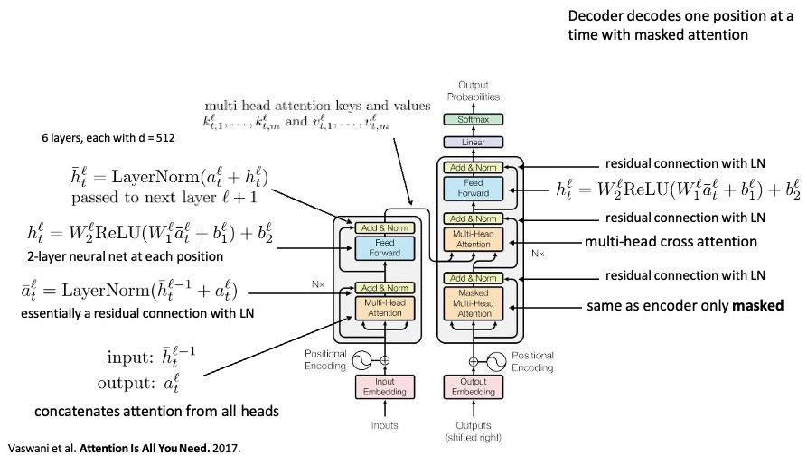

그래서 다 하나의 그림에 표현하면 다음과 같아집니다.

디코더는 하나의 포지션에 대해 디코딩 합니다.

멀티헤드 어텐션 에서, 모든 헤드의 어텐션을 컨캩 하고? 이후 레이어 노멀라이제이션 과정 거치고

그다음에 논리니어리티를 위해서 FFN 거친다음에 레이어 노멀라이제이션 한번 더 거쳐서, 디코더의 키와 밸류로 사용되는 값 넣어주고

디코더를 찬찬히 보면, 인코더랑 같은데 앞서 설명드린 마스크드 방법 적용한 멀티헤드 어텐션 레이어 이후 레이어 노멀라이제이션 과정 이후 크로스 멀티헤드 어텐션에 쿼리값으로 쓰일거 넣어주고, 레이어 노멀라이제이션 과정 이후에, FFN 레이어 노멀라이제이션 또 지나서 리니어 레이어와 소프트맥스 거쳐서 결과가 나오게 된다. 

인코더의 첫번째 멀티헤드 어텐션에 사용된 인풋 밸류가, 그 뒤 레이어 노멀라이제이션에 똑같이 들어가있는데, 그림에도 나와있듯
깊은 신경망을 학습시키기 위한 방법인 residual connection 을 적용 한 것 입니다.
일부 레이어를 건너뛰어 데이터가 신경망 구조의 후반부에 도달하는 또 다른 경로를 제공 이를 통해 gradient가 계속 커지거나 작아지는 문제를 해결

이런 구조를 갖고있습니다.

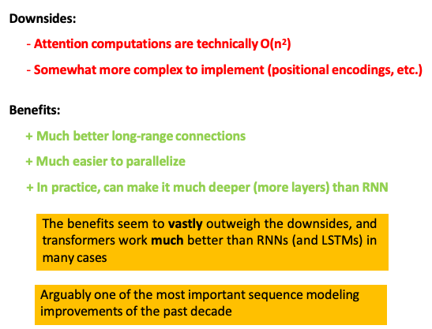

### references

    1. https://jalammar.github.io/illustrated-transformer/
    2. https://towardsdatascience.com/what-is-residual-connection-efb07cab0d55
    3. https://towardsdatascience.com/what-is-residual-connection-efb07cab0d55
    4. https://wikidocs.net/162098
    5. https://cs182sp21.github.io/
    6. https://www.youtube.com/@rail7462
    7. https://medium.com/@luvverma2011/demystifying-attention-mechanisms-in-sequence-to-sequence-models-transformers-part-1-98e2962408f0
    
