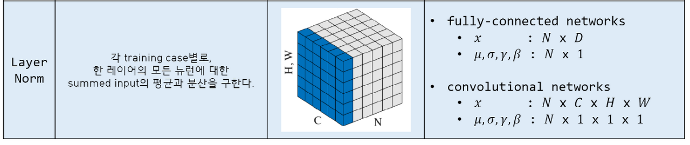
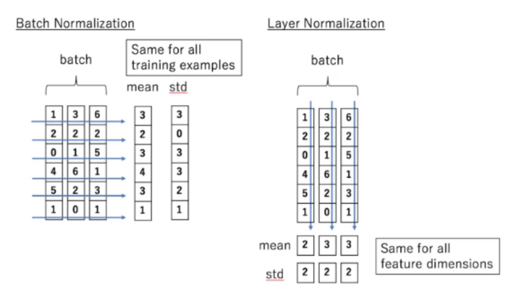

# Attention is all you need

* Background
    * 기존 방식의 한계점
        - the number of OPs required to relate signals from two arbitary input or output positions grows **<- cause**
        - linearly for ConvS2S andd logarithmically for ByteNet. This Makes it more difficult to learn dependencies between distant positions. **<- effect** 
    * In the transformer
        - this is reduced to a **_constant number of operations,_** albeit at the cost of reduced dffective resolution due to **_averaging attention-wighted positions._**
    * key
        - **_Attention_** is a generalisation of the idea of **_weighting inputs by distance._**
    * Self-attention (intra-attention)
        - is attention mechnism **_relating different positions of a sngle seq_** in order to compute a _representation of the seq_
    * End-to-end memory networks
        - are memory networks that use **_attention_** to compute a representation of the input sequence
        - based on recurrenct attention mechanism **_instead of seq-aligned recurrence_**
* Model Architecture
    * Most competetive neural seq transduction models 
        - encoder : maps an input seq of symbol representations **_x_ = (_x1_, _x2_, ..., _xn_)** to a sequence of continuous representations **_z_ = (_z1_, _z2_, ..., _zn_)**
        - decoder : Given **_z_ = (_z1_, _z2_, ..., _zn_)** generate an ouput seq **(_y1_, _y2_, ..., _yn_)** of symbols **one element at ta time**, consuming the previously generated symbols as additional input when generating the next.
    * **_Transformer follows this overall architecture using stacked slf-attention and pointwise, FC layers for both the encoder and decoder, shown in the left and right halves of picutre respectively_**
        
        
        출처 : https://jalammar.github.io/illustrated-transformer/
* Encoder
    * 인코더에는 6개 레이어가 있음. 각 레이어는 2개의 서브 레이어를 갖고 있음
    * 멀티헤드 셀프 어텐션 메카니즘
        - residual connections around each of the sub-layers, followed by layer normalization 
            
            - layer normalization : batch norm 에서 batch에 대한 의존도를 제거 -> batch 가 아닌 layer 를 기반으로 normalization 수행
            
            - 그림에서 batch norm 은 feature 단위 평균과 표준편차 계산 -> 정규화
                - feature 의 개수 6개 이므로, 6개의 표준편차와 평균을 구하고, 이를 바탕으로 batch norm
            - layer norm data sample 단위로 평균과 표준편차 계산 -> norm 진행
                - 특성의 개수와 상관없이 batch 내부의 데이터 개수가 3개이므로, 3개의 데이터 샘플에 3개의 평균, 3개의 표준편차 값을 계산 -> layer norm 
    * 포지션 와이즈 FC feed-forward 네트워크