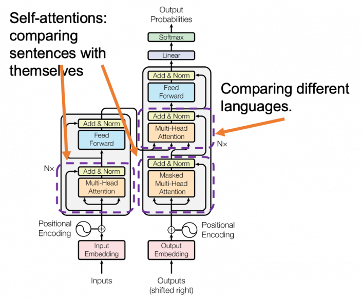
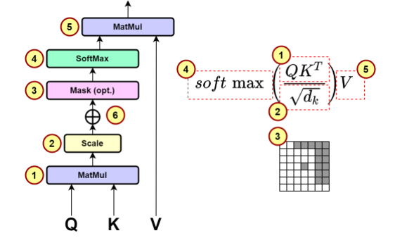
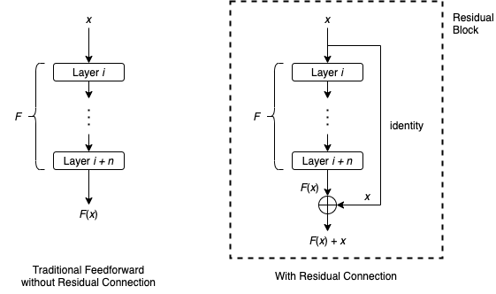
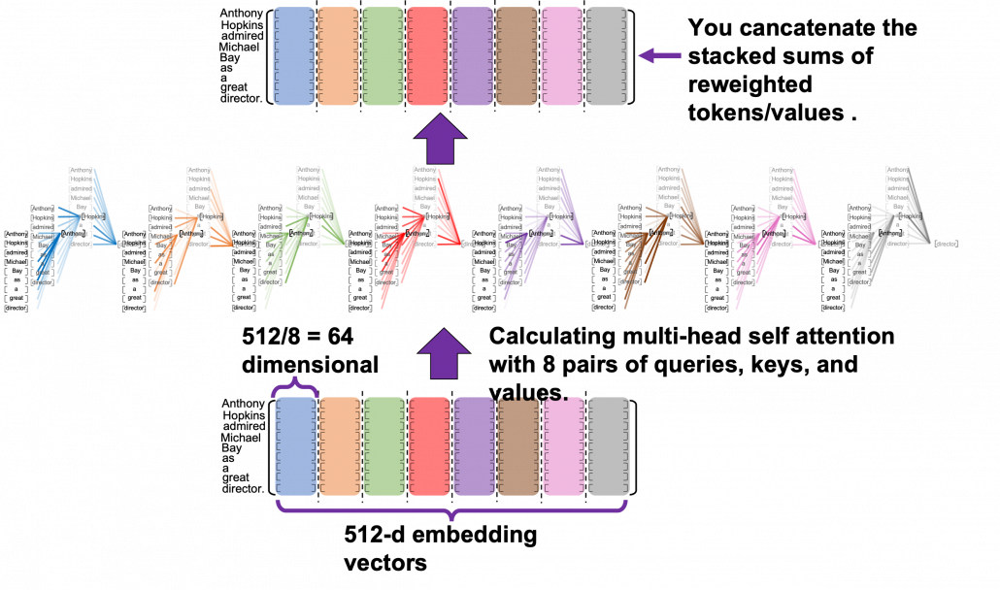

# Attention is all you need

* Background
  * 기존 방식의 한계점
    * the number of OPs required to relate signals from two arbitary input or output positions grows **<- cause**
    * linearly for ConvS2S andd logarithmically for ByteNet. This Makes it more difficult to learn dependencies between distant positions. **<- effect**
    * In the transformer
      * this is reduced to a **_constant number of operations,_** albeit at the cost of reduced dffective resolution due to **_averaging attention-wighted positions._**
    * key
      * **_Attention_** is a generalisation of the idea of **_weighting inputs by distance._**
    * Self-attention (intra-attention)
      * is attention mechnism **_relating different positions of a sngle seq_** in order to compute a _representation of the seq_
    * End-to-end memory networks
      * are memory networks that use **_attention_** to compute a representation of the input sequence
      * based on recurrenct attention mechanism **_instead of seq-aligned recurrence_**
* Model Architecture
  * Most competetive neural seq transduction models
    * encoder : maps an input seq of symbol representations **_X_ = (_x1_, _x2_, ..., _xn_)** to a sequence of continuous representations **_Z_ = (_z1_, _z2_, ..., _zn_)**
    * decoder : Given **_Z_ = (_z1_, _z2_, ..., _zn_)** generate an ouput seq **(_y1_, _y2_, ..., _yn_)** of symbols **one element at ta time**, consuming the previously generated symbols as additional input when generating the next.
  * **_Transformer follows this overall architecture using stacked slf-attention and pointwise, FC layers for both the encoder and decoder, shown in the left and right halves of picutre respectively_**  
        
        출처 - [1](https://jalammar.github.io/illustrated-transformer/)
* Encoder
  * 인코더에는 6개 레이어가 있음. 각 레이어는 2개의 서브 레이어를 갖고 있음
  * 멀티헤드 셀프 어텐션 메카니즘
    * [residual connections](#residual-connections) around each of the sub-layers, followed by [layer normalization](#layer-normalization)
    * That is the output of each sub-layer is **_LayerNorm(x + Sublayer(x))_**, where **_Sublayer(x)_** is the function implemented by the sub-layer itself.
    * To facilitate these residual connections, all sub-layers in the model, as well as the embedding layers, produce outputs of dimension **_dmodel = 512_**

* Decoder
  * 디코더에는 8개 레이어가 있음. 각 레이어는 3개의 서브 레이어를 갖고 있음
  * 멀티헤드 셀프 어텐션 메카니즘
    * 인코더 스택의 아웃풋에 대해 어텐션을 수행하는 세번째 서브 레이어가 포함됨
    * 디코더의 첫 번째 레이어는 인코더의 출력을 입력으로
    * residual connection 을 각각 서브레이어에 적용시키고, 레이어 노멀라이제이션 또한 수행.
        셀프어텐션 서브레이어를 변경하여 -> **_'to prevent positions from attending to subsequent positions'_**
    * **_"This masking, combined with fact that the output embeddings are offset by one position, ensures that the predictions for position i can depend only on the known outputs at positions less than i."_** <- 이부분 다시 공부

            

* Attention 8pararell attention layers
  * 어텐션 메카니즘
        
        
    * 어텐션을 활용할때, 중요한 부분 :: **_'Query, Key, Value' 가 각각 어떤것을 의미할지, 상세히 정의 해야, 어텐션이 제대로 동작할지, 어떻게 동작할지 예상이 가능함_**
        $$Attention(Q,K,V) = softmax( \frac{QK^T} {\sqrt{d_k}} )V$$
    * The two most commonly used attetntion functions are [additive attention](#additive-attention) , and [dot-product](#dot-product-attention) (multi-plicative) attention.
      * _**dot product attention is identical to this algorithm, except for the scaling factor of $$\frac{1}{\sqrt{d_k}}.$$**_
      * additive attention computes the compatibility function using a feed-forward network with a single hidden layer.
      * While the two are similar in theoretical complexity, dot-product attention is much faster and more space-efficient in practice, since it can be implemented using highly optimized matrix multiplication code.

      * While for small values of **_dk_** the two mechanisms perform similarly, additive attention outperforms dot product attention without scaling for larger values of **_dk_**.
        * **_dk_** is the dimensionality of the key.
      * Suspecting that for large values of **_dk_**, the dot products grow large in magnitude, **_pushing the softmax function into regions where it has extremely small gradients_**.
        * To counteract this effect, we scale the dot products by $$\frac{1}{\sqrt{d_k}}$$
            
            출처 - [4](https://wikidocs.net/162098)
      * Input Value
        * 입력값은 Q(query), K(key), V(value) 그리고 attention mask로 구성 되어 있습니다. 입력값 중 K, V는 같은 값 이어야 합니다. Q, K, V가 모두 동일한 경우는 self attention이라 합니다.
                attn_mask의 값은 pad(0) 부분만 True 입니다.

            1. MatMul Q, K-transpose
                * 위 그림의 수식 중 1번 Q * K-transpose를 하는 코드 입니다. 각 단어상호간에 가중치를 표현하는 테이블이 생성 되었습니다.
            2. Scale
                * 위 그림의 수식 중 2번 k-dimension에 루트를 취한 값으로 나누는 코드 입니다.
            3. Mask (Opt.)
                * 위 그림 수식 중 3번 mask를 하는 코드 입니다. mask를 한 부분이 -1e9로 매우 작은 값으로 변경된 것을 확인 할 수 있습니다.
            4. Softmax
                * 위 그림 수식 중 4번 softmax를 하는 코드 입니다. 가중치가 확률로 변환 된 값을 볼 수 있습니다. mask를 한 부분이 모두 0이 되었습니다.
            5. MatMul attn_prov, V
                * 위 그림 수식 중 5번 attn_prov * V를 하는 코드 입니다. Q와 동일한 shape 값이 구해집니다. 이 값은 V값들이 attn_prov의 가중치를 이용해서 더해진 값 입니다.

             $$MultiHead(Q,K,V) = Concat(head_1,...,head_h)W^O$$
             $$head_i = Attention(QW_i^Q,KW_i^K,VW_i^V)$$
             $$Attention(Q,K,V) = softmax(\frac{QK^T}{\sqrt{d_k}})V$$
      * where the projections are parameter metrices $$W_i^Q\in R^{d_{model} \times d_k},W_i^K\in R^{d_{model} \times d_k},W_i^V\in R^{d_{model} \times d_v}$$ and $$W^O\in R^{hd_v \times d_{model}}$$

    * Applications of Attention in our Model
      * The transformer uses multi-head attention in three different ways:
                1. queries come from the **_previous decoder layer_** and the **_memory keys_** and **_values_** come from the **_output of the encoder_**.
            
      * 인코더에는 셀프 어텐션 레이어가 포함되며, 셀프 어텐션 레이어에 있는 모든 키, 밸류, 쿼리는 하나의 공간으로부터 온다.
        * 이러면, 인코더의 이전 레이어의 출력이 발생한다.
        * 각각의 인코더에서의 포지션은 이전 인코더 레이어의 모든 포지션에 attend 할 수 있다.
      * self attention layers in the decoder allow each position in the decoder to attnd to all positions in the decoder up to and including that position. **[도면 생성 모델 적용시 이 부분 유의하자.]**
        * We need to prevent leftward information flow in th decoder to preserve the auto-regressive property.
                We implement this inside of scaled dot-product attention by masking out $$(setting to - \infty)$$ all values in the input of the softmax which correspond to illegal connections.

    * Position-wise Feed-Forward Networks
            $$FFN(x)=max(0,xW_1+b_1)W_2+b_2$$
      * 이것은 일반적인 피드 포워드 네트워크와 비슷하지
      * 본 논문에서는, 각각의 encoder, decoder 의 각각 레이어에는, FCFF network 가 적용되며, 이는, 각 위치에 대해 특징적으로 적용되며, 이는 ReLU 활성화를 사이에 두고 두 개의 선형 변환으로 구성됩니다.
    * Embeddings
      * convert the input tokens and output tokens to vectors of dimension dmodel, we also use the usual learned linear transformation and softmax function to convert the decoder output to predicted next-token probabilities.
      * 본 논문에서 웨이트 매트릭스를 공유하는데, (두개의 임베딩 레이어와 프리 소프트맥스 선형 변형에서 공유함)
      * 임베딩 레이어에서, 그 웨이트를 $$\sqrt{d_{model}}$$ 로 나눠서 사용한다.

---

* residual connections
    -

  * 깊은 신경망을 학습시키기 위한 방법
  * **_일부 레이어를 건너뛰어 데이터가 신경망 구조의 후반부에 도달하는 또 다른 경로를 제공_** 이를 통해 gradient가 계속 커지거나 작아지는 문제를 해결
  * layer **_i_** 에서 layer **_i+n_** 까지의 일련의 레이어와, 이들 레이어에 의해 표현되는 함수 **_F_** 로 두자, 레이어 **_i_** 로 들어오는 입력값 **_x_** 에 대해, 전통적인 ff network에서는 **_x_** 가 레이어를 순차적으로 지나며 레이어 **_i + n_** 의 output 은 **_F(x)_** 가 됨, but -> 몇개의 레이어를 bypass 하는 residual connection 은 아래 그림처럼 작용

    

    출처 - [2](https://towardsdatascience.com/what-is-residual-connection-efb07cab0d55)

    
    출처 - [3](https://towardsdatascience.com/what-is-residual-connection-efb07cab0d55)

* 포지션 와이즈 FC feed-forward 네트워크
    -

  * 여기에 내용추가

* layer normalization
    -

  * layer normalization : batch norm 에서 batch에 대한 의존도를 제거ㅈ -> batch 가 아닌 layer 를 기반으로 normalization 수행
    
  * 그림에서 batch norm 은 feature 단위 평균과 표준편차 계산 -> 정규화
    
  * feature 의 개수 6개 이므로, 6개의 표준편차와 평균을 구하고, 이를 바탕으로 batch norm
  * layer norm data sample 단위로 평균과 표준편차 계산 -> norm 진행
  * 특성의 개수와 상관없이 batch 내부의 데이터 개수가 3개이므로, 3개의 데이터 샘플에 3개의 평균, 3개의 표준편차 값을 계산 -> layer norm

* additive attention (Bahdanau Attention)
    -

  * 여기에 내용추가

* dot-product attention
    -

  * 여기에 내용추가

* multi-head attention
    -

  *
    

---

### references

    1. https://jalammar.github.io/illustrated-transformer/
    2. https://towardsdatascience.com/what-is-residual-connection-efb07cab0d55
    3. https://towardsdatascience.com/what-is-residual-connection-efb07cab0d55
    4. https://wikidocs.net/162098
